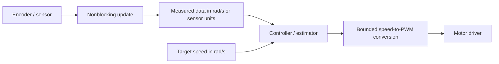

# Arduino Commons

Shared Arduino/ESP32 drivers, data types, and nonblocking utilities used by Indoor and Outdoor robot firmware. The library provides reusable building blocks; board pins, calibration, safety limits, and hardware validation belong to the consuming firmware.

[Doxygen API reference](https://nono-robotics.github.io/arduino-commons/) · [Coverage report](https://nono-robotics.github.io/arduino-commons/coverage/) · [License](LICENSE)

## Contents

- [Installation and dependencies](#installation-and-dependencies)
- [Library map](#library-map)
- [Usage patterns](#usage-patterns)
- [Examples](#examples)
- [Units and hardware limits](#units-and-hardware-limits)
- [Native tests and hardware validation](#native-tests-and-hardware-validation)

## Installation and dependencies

### PlatformIO

Add the library to an ESP32 Arduino environment:

```ini
[env:robot]
platform = espressif32
board = esp32dev
framework = arduino
lib_deps =
  adrianmarino/arduino-commons
```

PlatformIO installs declared package dependencies. Current optional-module dependencies include EWMA (encoder filtering), Adafruit BNO08x (IMU), TinyGPSPlus (GPS), U8g2 (display), and ArduinoJson (configuration storage). Use only the sensor/display modules needed by your firmware and confirm package versions in [`library.json`](library.json).

**Current integration caveat:** `ConfigStorage.h` includes `Logger.h`, but `Logger.h` is not present in this repository or declared in `library.json`. The included `ArduinoCommons.h` also includes `ConfigStorage.h`, so a standalone ESP32 build currently fails unless the consuming project supplies that header. `Logger` currently lives in `arduino-ros`; avoid depending on it from a standalone Commons sketch until this dependency boundary is resolved.

### Arduino IDE

Clone this repository into `Arduino/libraries/arduino-commons`, then restart the IDE. Install the library dependencies required by any module included by your sketch.

Include individual headers to keep dependencies and compile times smaller. `ArduinoCommons.h` is the umbrella include for common motor, sensor, timer, and utility types; newer specialized feedback and wheel snapshot types may require their own headers.

## Library map

| Area | Main headers/classes | Use |
|---|---|---|
| Actuation | `BLDCMotor`, `BLDCMotorBuilder`, `DCMotor` | Low-level PWM/direction/brake output |
| Speed control | `BLDCMotorController`, `FourWheelBLDCController`, `WToSignedPWMConverter` | Convert signed angular-speed targets to bounded PWM |
| Feedback control | `WheelSpeedFeedbackController`, `FourWheelBLDCFeedbackController`, `OutdoorFourWheelFeedbackController` | Apply wheel-speed feedback and fault handling |
| Wheel data | `FourWheelAngularSpeed`, `WheelSpeeds`, `WheelPosition` | Four-wheel commands and measured speed snapshots |
| Encoders | `AS5600Sensor`, `MagneticEncoder`, `MagneticEncoderUpdateService`, `EncoderAngularVelocityEstimator`, `I2CMultiplexor` | Read AS5600 position and estimate angular speed; optional TCA9548A multiplexing |
| IMU/GPS | `IMUSensor`, `IMUData`, `GPSSensor`, `GPSData` | BNO08x I2C IMU and serial GPS parsing |
| Odometry | `DifferentialRobotOdometry` | Average front/rear wheel speeds into left/right rad/s state |
| Timing | `SimpleTimer`, `DeltaTimeComputer` | Periodic nonblocking callbacks and elapsed-time measurement |
| Storage/config | `PersistentCounter`, `ConfigStorage`, `MultiResetDetector` | LittleFS-backed values/configuration and reset detection |
| UI/helpers | `Button`, `SimpleDisplay`, `StringUtils`, `timestamp` | Debounced input, OLED output, string/time helpers |

`DifferentialRobotOdometry` is a small shared data/aggregation type. It does not integrate pose `(x, y, theta)` and does not replace a ROS odometry estimator. Sensor-facing classes require real hardware and bus setup as described in their headers and API docs.

## Usage patterns

1. Declare objects with stable lifetime (global/static or owning application object).
2. Initialize hardware once in `setup()`.
3. Poll/update sensors and timers regularly from `loop()` or an application task.
4. Keep callbacks short and avoid blocking waits or `delay()` in runtime loops.
5. Calibrate electrical direction, motor dead zone, encoder scale, and limits on the actual assembled robot.



`BLDCMotorBuilder::build()` and several sensor builders return dynamically allocated pointers. If using these builders, call them only during initialization and retain the returned pointer for the object's full lifetime; do not construct them per loop iteration. APIs that accept references/stack objects can be used without heap allocation.

## Examples

### Signed four-wheel angular speed

`FourWheelAngularSpeed` stores front-left, front-right, back-left, and back-right values, all in rad/s. It does not apply motor calibration or PWM conversion.

```cpp
#include <FourWheelAngularSpeed.h>

FourWheelAngularSpeed target;

void setup() {
  target.updateFrom(2.0F, 2.0F, 2.0F, 2.0F);
}

void loop() {
  const float leftRadPerSec = target.getAverageLeftWInRad();
  const float rightRadPerSec = target.getAverageRightWInRad();
  (void)leftRadPerSec;
  (void)rightRadPerSec;
}
```

### BLDC driver setup and direct PWM

Use `BLDCMotor` for low-level signed duty-cycle commands. For angular-speed targets, prefer a controller/converter with calibrated `maxW`, minimum PWM, and maximum PWM. Pin/channel values below are examples only.

```cpp
#include <BLDCMotorBuilder.h>

BLDCMotor *motor;

void setup() {
  motor = BLDCMotorBuilder(5, 18, 19) // PWM, direction, brake GPIOs
              .setChannel(0)
              .setFrequency(20000)
              .setResolutionInBits(11)
              .build();
  motor->setup();
  motor->setPwmSpeed(0); // Signed duty, bounded by configured resolution.
}

void loop() {
  // Set calibrated signed duty only when a fresh command is available.
}
```

### Convert rad/s to signed PWM

`WToSignedPWMConverter` constructor takes maximum absolute angular speed, PWM resolution in bits, minimum nonzero PWM magnitude, and optional maximum PWM magnitude. `convert()` is the API (not `wToSignedPWM()`). The conversion has a minimum-PWM region; do not assume PWM is proportional to speed near zero.

```cpp
#include <WToSignedPWMConverter.h>

WToSignedPWMConverter converter(10.0F, 11, 50, 1800);

void loop() {
  const int pwm = converter.convert(5.0F); // +5 rad/s -> bounded positive duty
  (void)pwm;
}
```

### Read an IMU without blocking

`IMUSensor` reads BNO08x over I2C. Initialize the bus and sensor once, then poll `update()` regularly. The callback receives the sensor's updated `IMUData`.

```cpp
#include <Wire.h>
#include <IMUSensor.h>

void onImuUpdate(IMUData *data) {
  // Consume a fresh sample; keep callback short.
  (void)data;
}

IMUSensor imu(onImuUpdate);

void setup() {
  Wire.begin();
  if (imu.init()) imu.begin();
}

void loop() {
  imu.update();
}
```

### Poll GPS serial input

`GPSSensor` parses incoming serial bytes during `update()` and invokes its callback when its update condition is met. Pass hardware serial, RX/TX pins, callback, and baud rate to the constructor. The serial port/pins must match the board wiring.

```cpp
#include <GPSSensor.h>

void onGpsUpdate(GPSData *data) {
  (void)data;
}

GPSSensor *gps;

void setup() {
  // Constructor configures Serial2 at 9600 baud with the selected pins.
  gps = new GPSSensor(&Serial2, 16, 17, onGpsUpdate, 9600);
}

void loop() {
  gps->update();
}
```

### Periodic work with `SimpleTimer`

Timers use elapsed `millis()` time and do not block. Call `update()` frequently; callback work itself should also be bounded and nonblocking.

```cpp
#include <SimpleTimer.h>

SimpleTimer statusTimer(1000, []() {
  Serial.println("one-second task");
});

void setup() {
  Serial.begin(115200);
}

void loop() {
  statusTimer.update();
}
```

### Differential left/right speed summary

This helper averages front and rear wheel angular velocity on each side. It does not compute position, heading, wheel radius conversion, or time integration.

```cpp
#include <DifferentialRobotOdometry.h>

FourWheelAngularSpeed measuredWheels;
DifferentialRobotOdometry sides;

void loop() {
  measuredWheels.updateFrom(3.0F, 3.2F, 2.8F, 3.0F); // rad/s
  sides.updateFrom(measuredWheels);
  const float left = sides.getLeftWInRad();
  const float right = sides.getRightWInRad();
  (void)left;
  (void)right;
}
```

### Persistent counter

LittleFS must be available on the target. Confirm filesystem mount/format policy in the firmware before storing important state.

```cpp
#include <PersistentCounter.h>

PersistentCounter bootCounter("/reboots.txt");
int bootCount;

void setup() {
  bootCount = bootCounter.read();
  bootCounter.save(bootCount + 1);
}
```

`PersistentCounter::read()` and `save()` use an 8-bit count; values wrap above 255. Use `ConfigStorage` or a wider custom representation when that range is insufficient.

### Encoder update service

For multiple AS5600 encoders sharing a fixed I2C address, use an I2C multiplexer (commonly TCA9548A). Initialize `Wire`, build/register encoder channels during setup, and poll the service from the main loop. See the builder header and [API reference](https://nono-robotics.github.io/arduino-commons/) for callback and channel details.

## Units and hardware limits

- Wheel angular speed and `WToSignedPWMConverter` inputs/limits: radians per second (rad/s), signed for direction.
- `FourWheelAngularSpeed` order: front-left, front-right, back-left, back-right.
- `WheelSpeeds` snapshot additionally stores left/right averages; its ROS multi-array wire ordering is documented in `arduino-ros`.
- PWM values are signed duty magnitudes bounded by the motor's configured resolution and converter limit. Electrical direction, actual dead zone, and usable maximum vary by driver, motor, battery, and load.
- Encoder and IMU update intervals, GPS baud/pins, I2C address, display controller, and storage mount behavior are hardware/configuration-specific.

Tune against measured wheel speed/odometry on the intended robot. A calculated PWM value alone does not establish safe or accurate physical motion.

## Native tests and hardware validation

Run all mock-backed native tests:

```sh
pio test -e native
```

Run regression tests and generate local coverage:

```sh
commands/regression-test
# report: coverage/index.html
```

See [`test/README`](test/README) for suite scope, mocks, coverage exclusions, and limitations. Native tests do not verify hardware timing, electrical PWM waveforms, physical I2C buses, sensor firmware, filesystem media, or end-to-end robot integration. Test hardware on the intended robot after changing pins, calibration, or motor parameters.
